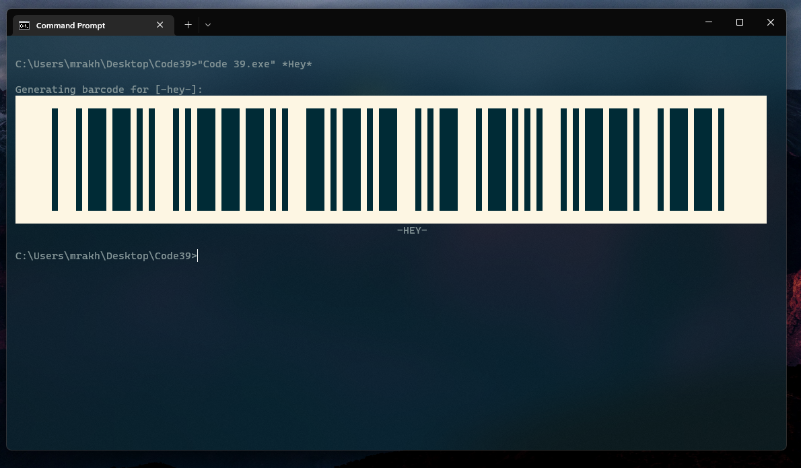

# Code 39
Code39 Console Barcode generator written with C#.

# How to use
## Document
Executing "Code 39.exe" without arguments will generate document of software:
```
Generates Code39 Barcodes in console.

Usage: "Code 39.exe" [message]

Symbol set contains 43 characters:
        A-Z, 0-9, and -, ., *, $, /, +, %, SPACE.

Examples:
        "Code 39.exe" Hello
        "Code 39.exe" /Javad/
        "Code 39.exe" 4457
        "Code 39.exe" "A long message"
```

Screenshot of document:


## Generate Barcode
Software accepts only one argument to generate barcode from. It can be a single word or multi-words inside two double-qoute signs.


Software also provides a basic validation of inputs to check illegal characters:  




### System Variables also accepted

